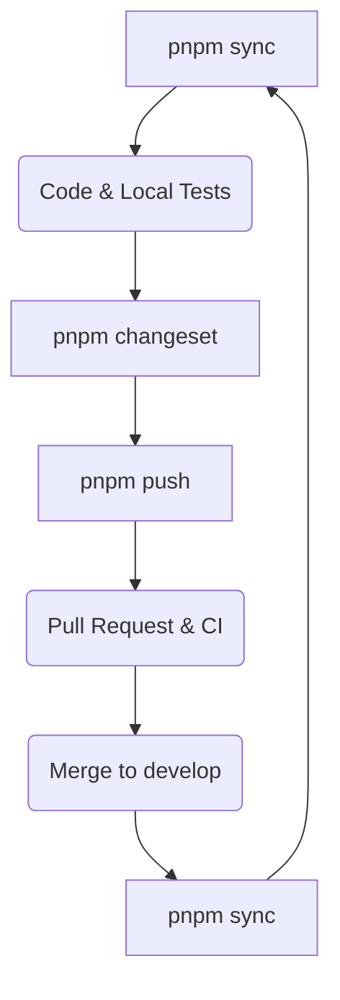

# Contributing to Shoperzz

Welcome. Whether you're from Lagos, São Paulo, Seoul, or Berlin — if you want to contribute to Shoperzz, you're in the right place.

This guide covers everything: how to set up your environment, how to submit a PR, how to create a plugin, and how the community operates.

---

## Table of Contents

1. [Before you start](#1-before-you-start)
2. [Setting up the environment](#2-setting-up-the-environment)
3. [Understanding the structure](#3-understanding-the-structure)
4. [Types of contributions](#4-types-of-contributions)
5. [Git workflow](#5-git-workflow)
6. [Commit convention](#6-commit-convention)
7. [Code standards](#7-code-standards)
8. [Tests](#8-tests)
9. [Creating a plugin](#9-creating-a-plugin)
10. [Opening a Pull Request](#10-opening-a-pull-request)
11. [Review process](#11-review-process)
12. [Versioning and releases](#12-versioning-and-releases)

---

## 1. Before you start

### Search before creating

Before opening an issue or starting to code:

- **Existing issues** — someone may already be working on it
- **Open PRs** — the feature may already be in review
- **Documentation** — <https://docs.shoperzz.dev>
- **Discord** — <https://discord.gg/shoperzz> — ask the community

### What is welcome

Anything that makes Shoperzz better for developers and their users worldwide. In particular:

- New payment plugins (Flutterwave, M-Pesa, Stripe, PayPal, etc.)
- Integrations with local payment providers anywhere in the world
- Bug fixes
- Performance improvements
- Documentation improvements and translations
- Typo corrections — yes, those count

---

## 2. Setting up the environment

### Prerequisites

```
Node.js  >= 20 LTS
pnpm     >= 9.0.0 (Mandatory)
Git      >= 2.38
```

> [!IMPORTANT]
> **PNPM is the only allowed package manager.** Using `npm` or `yarn` will corrupt the `pnpm-lock.yaml` file. PRs with corrupted lockfiles or evidence of other package managers will be automatically rejected.

### Installation

```bash
# 1. Fork and clone
git clone https://github.com/[your-username]/shoperzz.git
cd shoperzz

# 2. Install dependencies with pnpm ONLY
pnpm install

# 3. Setup hooks and tools
pnpm setup
```

The `setup` script installs dependencies, configures Husky (git hooks), activates the commit template, and verifies everything is in order.

### Adding the upstream remote

```bash
git remote add upstream https://github.com/shoperzz/shoperzz.git

# Verify
git remote -v
# origin    https://github.com/[your-username]/shoperzz.git
# upstream  https://github.com/shoperzz/shoperzz.git
```

### Verifying your setup

```bash
pnpm doctor
```

If everything is green, you're ready. If something is red, the script tells you exactly what to fix.

---

## 3. Understanding the structure

```
shoperzz/
├── apps/
│   ├── api/        ← Shoperzz platform API (auth, subscriptions, newsletter)
│   ├── web/        ← shoperzz.dev marketing site
│   ├── docs/       ← documentation site (Nextra / Docusaurus)
│   └── admin/      ← platform admin UI
├── packages/
│   ├── core/       ← @shoperzz/core — the orchestrator
│   ├── common/     ← @shoperzz/common — shared types and utilities
│   ├── testing/    ← @shoperzz/testing — test helpers for plugin authors
│   └── cli/        ← @shoperzz/cli — the command line interface
├── plugins/            ← official plugins (each is a separate npm package)
├── demos/              ← non-published e-commerce reference projects (store1, marketplace1, api1...)
├── e2e/                ← cross-package end-to-end tests only
├── tooling/            ← shared tsconfig, jest config, eslint, scripts
└── assets/             ← logos, images, social assets
```

> **Important:** `apps/api` is the Shoperzz **platform** API, not an e-commerce API.
> E-commerce reference implementations live in `demos/` (e.g. `demos/store1`).

Key files to know:

| File | Role |
|---|---|
| `demos/store1/src/shoperzz.config.ts` | Reference config — how a store declares its plugins |
| `demos/store1/src/app.module.ts` | One line: `ShoperzzCoreModule.forRoot(config)` |
| `packages/core/src/plugin-registry/` | How plugins load at startup |
| `packages/core/src/event-bus/` | Inter-plugin communication system |
| `tooling/tsconfig.base.json` | TypeScript config all packages extend |
| `CLAUDE.md` | Rules for AI coding agents on this codebase |

Each package in `packages/` and `plugins/` is published independently to npm. They are versioned separately via Changesets.

---

## 4. Types of contributions

### Bug fix

1. Open an issue using the **Bug Report** template if one doesn't exist
2. Comment on the issue to signal you're working on it
3. Create your branch from `develop`: `fix/short-description`
4. Fix it + add a test that reproduces the bug
5. Open a PR

### New feature

1. Open a **Feature Request** issue first for discussion
2. Wait for a maintainer go-ahead before coding (avoids unmerged work)
3. Create your branch from `develop`: `feat/short-description`
4. Implement + tests
5. Open a PR

### New plugin

See the [Creating a plugin](#9-creating-a-plugin) section.

### Documentation

Branch: `docs/short-description`
No prior approval needed for documentation corrections.

---

## 5. Git workflow

### Stay up to date before starting

```bash
git fetch upstream
git checkout develop
git rebase upstream/develop
```

### Create your working branch

```bash
# Always from develop — never from main
git checkout -b feat/payment-mtn-momo
```

**Branch naming convention:**

```
feat/[description]      ← new feature
fix/[description]       ← bug fix
docs/[description]      ← documentation
refactor/[description]  ← refactoring
chore/[description]     ← maintenance
```

### Staying in sync during development

```bash
git fetch upstream
git rebase upstream/develop

# If conflicts → resolve, then
git rebase --continue

# Force push required after a rebase
git push origin feat/payment-mtn-momo --force-with-lease
```

### The Shoperzz Development Lifecycle

To maintain 100% technical alignment and avoid conflicts, every contributor MUST follow this cycle:

1.  **`pnpm sync`** — Sync local state with global `upstream/develop`.
2.  **CODE** — Implement your changes/fixes.
3.  **`pnpm changeset`** — Declare your versioning intent.
4.  **`pnpm push`** — Local audit + push to your fork.
5.  **PULL REQUEST** — Open and review on GitHub.
6.  **MERGE** — PR is merged into `upstream/develop`.
7.  **`pnpm sync`** — **CRITICAL**: Final sync to bring merged changes back to your local machine.



### Using the sync and push scripts

Shoperzz provides two automation scripts in `tooling/` to ensure a consistent workflow and prevent CI failures.

```bash
# 1. Before starting or after a break: Sync with upstream
pnpm sync

# 2. Before pushing your work: Validate and push
pnpm push
```

The `pnpm push` script performs the following checks:

- **Synchronization**: Verifies if you are behind `upstream/develop`.
- **Quality**: Runs `lint`, `typecheck`, and `test` across the workspace.
- **Versioning**: Checks if a `.changeset` is needed and prompts you to create one.
- **Safety**: Pushes to your fork with `--force-with-lease` if you rebased.

Always use `pnpm push` instead of `git push` to ensure your PR is "green" before submission.

---

## 6. Commit convention

Shoperzz uses **Conventional Commits**. The format is validated automatically by Husky at commit time.

### Format

```
type(scope): short description in lowercase
```

### Available types

| Type | When | Version effect |
|---|---|---|
| `feat` | New feature | MINOR bump |
| `fix` | Bug fix | PATCH bump |
| `perf` | Performance improvement | PATCH bump |
| `security` | Security fix | PATCH bump |
| `refactor` | Refactoring with no visible change | no bump |
| `test` | Tests only | no bump |
| `docs` | Documentation only | no bump |
| `chore` | Maintenance, deps | no bump |
| `ci` | CI/CD | no bump |

### Available scopes

```
core · common · cli · testing
payment · notifications · webhook · sms · delivery
graphql · database · docs · deps · config · ci
plugin-[name] (e.g. plugin-stripe, plugin-whatsapp, etc.)
```

### Valid examples

```bash
feat(payment): add Stripe payment handler with sandbox support
fix(webhook): handle provider duplicate webhook idempotently
security(webhook): add timing-safe HMAC signature comparison
docs(contributing): add plugin submission checklist
chore(deps): update vendure to 2.3.0
test(plugin-paypal): add webhook expiry edge case tests
```

### Breaking change

```bash
feat(core)!: rename ShoperzzPlugin.getNestModule to getModule

BREAKING CHANGE: ShoperzzPlugin.getNestModule() is renamed to getModule()
to align with NestJS conventions. Update all existing plugins accordingly.
```

### What happens if the format is incorrect?

```bash
$ git commit -m "add wave payment"
✖  type may not be empty
✖  subject may not be empty

husky - commit-msg hook exited with code 1
```

The commit is rejected locally. You see exactly which rule was violated.

---

## 7. Code standards

### TypeScript strict

All code is TypeScript strict. No explicit `any`. No `// @ts-ignore` without a commented justification.

### Naming — the essential rules

Full reference: [`05-reference/16-naming-conventions.md`](05-reference/16-naming-conventions.md)

Quick cheatsheet:

| What | Format | Example |
|---|---|---|
| npm package | `@shoperzz/plugin-[type]-[name]` | `@shoperzz/plugin-payment-wave` |
| Plugin folder | `[type]-[name]` | `payment-wave/` |
| Source file | `[name].[role].ts` | `wave.service.ts` |
| Class | PascalCase + role suffix | `WavePlugin`, `WaveService` |
| Function | camelCase, clear verb | `initiateWavePayment()` |
| Constant | SCREAMING_SNAKE_CASE | `WAVE_TIMEOUT_MINUTES` |
| Event bus | `domain.entity.action` | `payment.wave.confirmed` |
| DB table | `prefix_plural` | `wave_sessions` |
| Env var | `SHOPERZZ_PLUGIN_VAR` | `SHOPERZZ_WAVE_API_KEY` |
| GraphQL type | PascalCase, plugin-prefixed | `WavePaymentSession` |
| Git branch | `type/description` | `feat/plugin-payment-wave` |

### What we never do

- Import a service from another plugin directly — always use the event bus
- `synchronize: true` in TypeORM outside local dev
- Hard delete data — always soft delete
- Store API keys or tokens in code
- Log phone numbers, emails, or personal data in plain text

### Lint and format

```bash
pnpm lint          # ESLint
pnpm format        # Prettier
pnpm typecheck     # TypeScript
```

These three run automatically on modified files via `lint-staged` at commit time.

---

## 8. Tests

### Where tests live

```
plugin-[name]/
└── __tests__/
    ├── unit/
    │   ├── [name].service.spec.ts
    │   └── [name].handler.spec.ts
    ├── integration/
    │   └── [name].integration.spec.ts
    └── fixtures/
        ├── webhook-confirmed.json      ← real anonymized payload
        └── webhook-failed.json
```

### Running tests

```bash
# Test everything
pnpm test:all

# A specific package
pnpm --filter @shoperzz/plugin-payment-orange-money test

# With coverage
pnpm --filter @shoperzz/plugin-payment-orange-money test --coverage

# Watch mode
pnpm --filter @shoperzz/plugin-payment-orange-money test --watch
```

### Mandatory coverage thresholds

- **Global:** 80% minimum
- **Webhook handlers:** 100% — no exceptions
- **Payment services:** 100% — no exceptions

A PR that drops coverage below these thresholds is blocked by CI.

### Writing good tests

```typescript
// ✓ Test that describes the expected behavior
it('rejects a webhook with an invalid signature', async () => {
  const payload = loadFixture('webhook-confirmed.json')
  await expect(handler.handleWebhook(payload, 'invalid-sig'))
    .rejects.toThrow(InvalidWebhookSignatureException)
})

// ✓ Idempotency test — critical for payments
it('does not process the same webhook twice', async () => {
  const payload = loadFixture('webhook-confirmed.json')
  transactionRepo.setExistingTransaction({ status: 'confirmed' })
  await handler.handleWebhook(payload)
  expect(eventBus.emitted).toHaveLength(0)
})
```

### Fixtures — mandatory rule

JSON files in `fixtures/` are **anonymized** real payloads. Replace phone numbers with `771234567`, names with `Test User`, IDs with fictitious IDs of the same format.

---

## 9. Creating a plugin

### Generate the structure

```bash
pnpm plugin:create payment-mtn-momo
```

The script asks a few questions and generates the complete structure with all standard files.

### Plugin structure

```
plugins/payment-mtn-momo/
├── src/
│   ├── index.ts                    ← public exports only
│   ├── mtn-momo.plugin.ts          ← implements ShoperzzPlugin
│   ├── mtn-momo.module.ts          ← NestJS module
│   ├── mtn-momo.service.ts         ← business logic
│   ├── mtn-momo.handler.ts         ← webhooks and events
│   ├── mtn-momo.events.ts          ← typed event definitions
│   └── mtn-momo.config.ts          ← configuration interface
├── __tests__/
│   ├── unit/
│   └── fixtures/
├── shoperzz.plugin.yml             ← mandatory manifest
├── package.json
└── README.md
```

### The `shoperzz.plugin.yml` manifest

```yaml
name: "@shoperzz/plugin-payment-mtn-momo"
version: "1.0.0"
category: "payment"

permissions:
  - order.read
  - order.write
  - payment.write
  - webhook.receive

emits:
  - payment.mtn-momo.initiated
  - payment.mtn-momo.confirmed
  - payment.mtn-momo.failed

listens:
  - order.created
```

### Community plugin

If your plugin is not intended to be official:

```bash
pnpm plugin:create payment-flutterwave --community
```

It will be under `@shoperzz-community/plugin-payment-flutterwave` on npm. To submit it to the official registry, use the **Plugin Submission** issue template.

---

## 10. Opening a Pull Request

### Before opening the PR

```bash
# 1. Tests pass
pnpm test:all

# 2. Clean lint
pnpm lint && pnpm typecheck

# 3. Changeset created if packages were modified
pnpm changeset
# → interactive interface → choose package → patch/minor/major → describe

# 4. Everything committed and pushed
pnpm push    # the script verifies everything before pushing
```

### Creating the PR

- **Base:** always `develop` — never `main`
- **Title:** same format as commits — `feat(payment): add MTN MoMo plugin`
- **Description:** fill in the template honestly — especially the checklist

### What CI checks

The PR is blocked if:

- Lint fails
- TypeScript has errors
- Tests fail
- Coverage is insufficient
- A `.changeset` file is missing when packages have been modified
- PR commits don't respect the commit convention

---

## 11. Review process

### Timelines

- **First response:** 3 business days
- **Full review:** 7 business days

If you haven't heard back after 7 days, ping the maintainer in the PR comments.

### What reviewers look at

- The code does what the PR says
- Tests cover the important cases (especially webhook edge cases)
- Naming conventions are followed
- No sensitive data in code or tests
- The PR doesn't introduce regressions

### Responding to feedback

- Every review comment is a conversation, not an order
- If you disagree, say why — that's legitimate
- When you've applied a change, mark the thread as resolved
- Add a commit with the fixes (don't rebase history during review)

---

## 12. Versioning and releases

Shoperzz uses **Changesets** for version management. You don't need to worry much about this — here's how it works on your end.

### Declaring your change

After coding, before pushing:

```bash
pnpm changeset
```

Interactive interface:

```
🦋  Which packages changed?
    ◉ @shoperzz/plugin-payment-mtn-momo

🦋  Type of change?
    ○ patch (bug fix)
    ◉ minor (new feature)
    ○ major (breaking change)

🦋  Describe the change:
    › Add MTN MoMo payment plugin for Cameroon and Central Africa
```

A `.changeset/[hash].md` file is created. Commit it with your PR.

### What happens next

It's automatic. When your PR is merged, Changesets accumulates the changesets. At the next release, it bumps versions, updates CHANGELOGs, publishes to npm, and creates git tags — no manual intervention.

---

## Questions?

- **Discord:** <https://discord.gg/shoperzz> — fastest
- **GitHub Discussions:** for longer questions
- **Issues:** only for bugs and feature requests

Thank you for contributing to Shoperzz.
